# DNS-Based Command-and-Control and Exfiltration Investigation

## Objective

Detect and investigate abnormal DNS behavior using Security Onion, Zeek DNS telemetry, Windows endpoint process telemetry, CyberChef, and MITRE ATT&CK.

The goal of this project is to establish a normal DNS baseline, generate controlled DNS activity that resembles common command-and-control and exfiltration patterns, identify anomalous DNS queries through network hunting, decode data embedded in DNS subdomains, analyze periodic beaconing behavior, correlate network events with endpoint process telemetry, scope the activity across the monitored environment, map the observed behavior to MITRE ATT&CK, and document the investigation from a SOC analyst perspective.

## Lab Environment

* Windows 10 — target endpoint and controlled activity source (`192.168.56.105`)
* Kali Linux — controlled DNS server running `dnsmasq` (`192.168.56.10`)
* Security Onion 3.2.0 — monitoring and investigation platform
* Zeek — DNS and connection telemetry
* Endpoint process telemetry — process execution visibility from the Windows endpoint
* CyberChef — decoding and payload analysis
* MITRE ATT&CK — behavior classification and technique mapping
* VirtualBox — isolated lab environment

## Lab Topology

The investigation was performed inside an isolated VirtualBox environment. The Windows 10 endpoint sent DNS queries to the Kali Linux host, where `dnsmasq` provided the controlled DNS service. Security Onion observed the DNS traffic with Zeek and also collected endpoint process telemetry from the Windows system. CyberChef and MITRE ATT&CK were used during analysis and behavior classification.

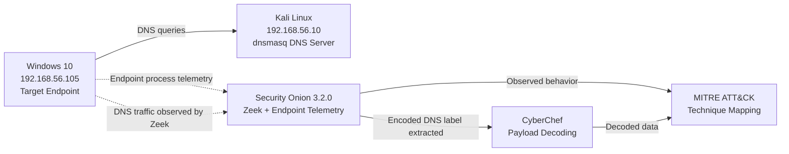

## Scenario

A SOC analyst is investigating DNS activity from the Windows endpoint `Victim` after noticing behavior that differs from the established baseline.

The investigation focuses on two DNS patterns that can be associated with malicious activity:

- unusually long DNS query names containing encoded-looking data
- repeated DNS requests occurring at a regular interval

The objective is to determine:

- what normal DNS behavior looks like for the lab endpoint
- whether the endpoint generated unusually long DNS queries
- whether data was embedded inside DNS subdomains
- whether the embedded data can be decoded
- whether the endpoint generated periodic DNS beacon-like traffic
- which process generated the repeated DNS requests
- whether network and endpoint telemetry support the same activity timeline
- whether similar long-query activity was observed from any other monitored host
- which MITRE ATT&CK techniques describe the observed behavior
- how a SOC analyst should respond if similar activity appeared in a real environment

## Controlled DNS Infrastructure

A controlled DNS service was configured on the Kali Linux host at `192.168.56.10` using `dnsmasq`.

The service was used only inside the isolated lab and allowed the Windows endpoint to generate predictable DNS traffic that could be observed and investigated in Security Onion.

The lab domain namespace used during testing was:

```text
lab.test
```

This provided a safe environment for generating normal DNS requests, encoded DNS subdomains, and periodic DNS beacon-like traffic without contacting external infrastructure.

## DNS Baseline

Before generating suspicious activity, normal DNS requests were created so that a baseline could be established.

Security Onion Hunt was used to review Zeek DNS events from the Windows endpoint within the controlled `lab.test` namespace.

Query used:

```text
event.dataset:zeek.dns AND source.ip:192.168.56.105 AND dns.highest_registered_domain:"lab.test"
| table soc_timestamp event.dataset source.ip source.port destination.ip destination.port network.transport dns.query.length dns.query.name dns.query.type_name dns.response.code_name log.id.uid network.community_id
```

The baseline showed short, readable DNS names such as:

- `api.lab.test`
- `login.lab.test`
- `files.lab.test`
- `telemetry.lab.test`

The observed query lengths were short and consistent with ordinary hostnames in the lab. Both `A` and `AAAA` lookups were visible.

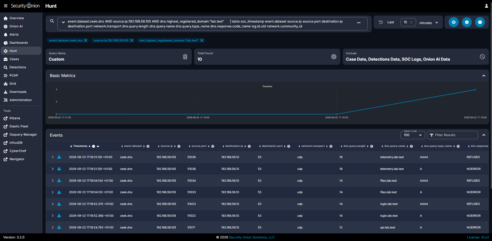

This baseline provided a reference point for comparing later DNS activity.

## Simulated DNS Exfiltration Behavior

Controlled DNS queries were then generated with hex-encoded data embedded into the left-most DNS label under the following namespace:

```text
exfil.lab.test
```

An example observed query was:

```text
534f432d4c41422d44454d4f2d303035.exfil.lab.test
```

The query name was significantly longer than the normal baseline and contained a hexadecimal-looking character pattern rather than a human-readable hostname.

No sensitive or real user data was used. The embedded values were harmless lab markers created only to reproduce telemetry associated with DNS-based exfiltration techniques.

## Long DNS Query Hunt

A length-based hunt was used to identify DNS queries that deviated from the normal baseline.

Query used:

```text
event.dataset:zeek.dns AND source.ip:192.168.56.105 AND dns.query.length:[31 TO 255]
| table soc_timestamp event.dataset source.ip source.port destination.ip destination.port dns.query.length dns.query.name dns.query.type_name dns.response.code_name
```

Security Onion returned the controlled long DNS queries. The suspicious `exfil.lab.test` entries had a query length of `47`, clearly separating them from the shorter baseline queries.

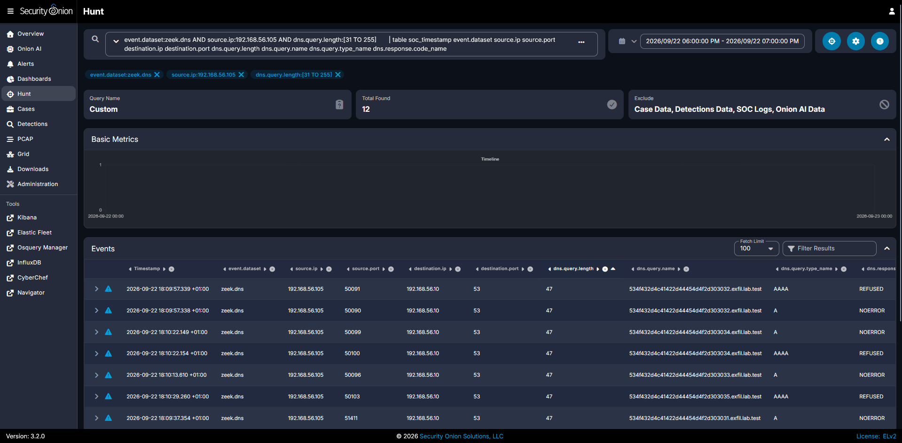

The query-length threshold is a hunting heuristic rather than proof of malicious activity. Legitimate services can also generate long DNS names, so the result requires additional investigation.

## Payload Decoding with CyberChef

The encoded portion of one suspicious DNS query was extracted for analysis.

Value analyzed:

```text
534f432d4c41422d44454d4f2d303035
```

CyberChef identified the value as hexadecimal data. Using the `From Hex` operation produced:

```text
SOC-LAB-DEMO-005
```

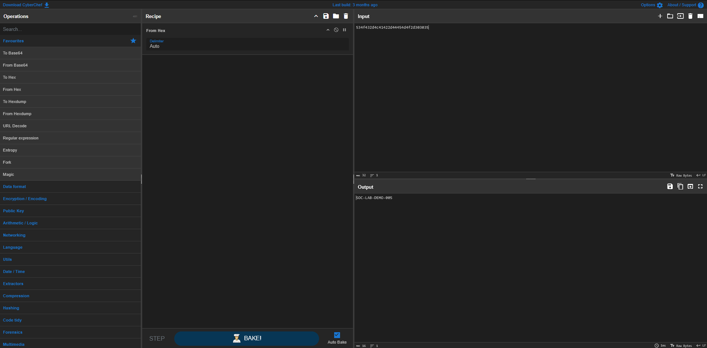

This demonstrated that the apparently random DNS label contained recoverable application data rather than being an ordinary hostname.

The decoded value was an intentionally harmless lab marker. The purpose of the exercise was to demonstrate how data can be represented inside DNS labels and how an analyst can extract and decode it during an investigation.

## Zeek Suspicious DNS Event Analysis

A suspicious Zeek DNS event was opened in detail to inspect the fields recorded by Security Onion.

The event showed:

- source IP: `192.168.56.105`
- destination IP: `192.168.56.10`
- destination port: `53`
- DNS query length: `47`
- DNS query type: `A`
- query name: `534f432d4c41422d44454d4f2d303035.exfil.lab.test`
- response code: `NOERROR`
- resolved IP: `192.168.56.10`
- decoded marker: `SOC-LAB-DEMO-005`

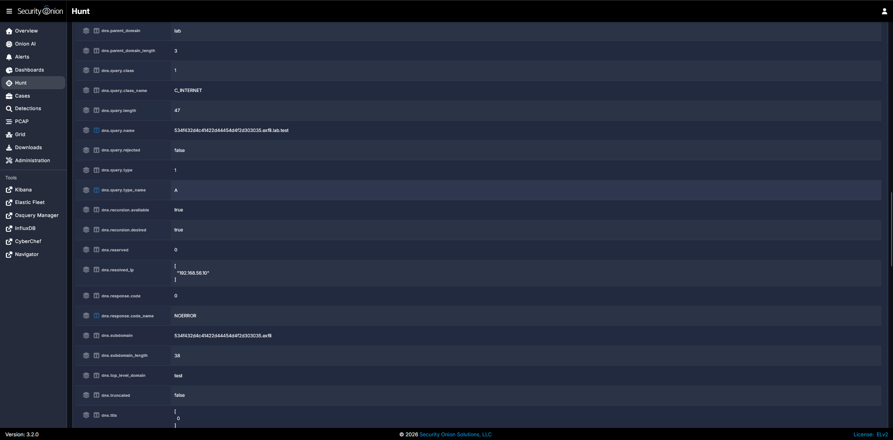

This event connected the DNS hunt result to the underlying Zeek telemetry and confirmed that the encoded label was transmitted as part of an actual DNS query from the Windows endpoint to the controlled DNS server.

## DNS Beaconing Simulation

The next stage simulated periodic DNS check-ins that resemble beaconing behavior.

The following PowerShell loop was executed on the Windows endpoint:

```powershell
for ($i=1; $i -le 8; $i++) {
    nslookup checkin.c2.lab.test. 192.168.56.10 | Out-Null
    Start-Sleep -Seconds 10
}
```

The command performed eight DNS lookups for `checkin.c2.lab.test`, waiting ten seconds between each request.

`Out-Null` suppressed the local console output but did not hide the network traffic. Zeek was still able to record the DNS requests.

This was a controlled simulation of DNS beaconing. No malware or real command-and-control infrastructure was used.

## Beacon Cadence Analysis

Security Onion Hunt was used to isolate the `A` record queries created by the beaconing simulation.

Query used:

```text
event.dataset:zeek.dns AND source.ip:192.168.56.105 AND dns.query.name:"checkin.c2.lab.test" AND dns.query.type_name:A
```

Eight Zeek DNS events were returned.

The timestamps showed a highly regular cadence of approximately ten seconds between successive requests, for example:

```text
21:53:10
21:53:20
21:53:30
21:53:40
21:53:50
21:54:00
21:54:10
```

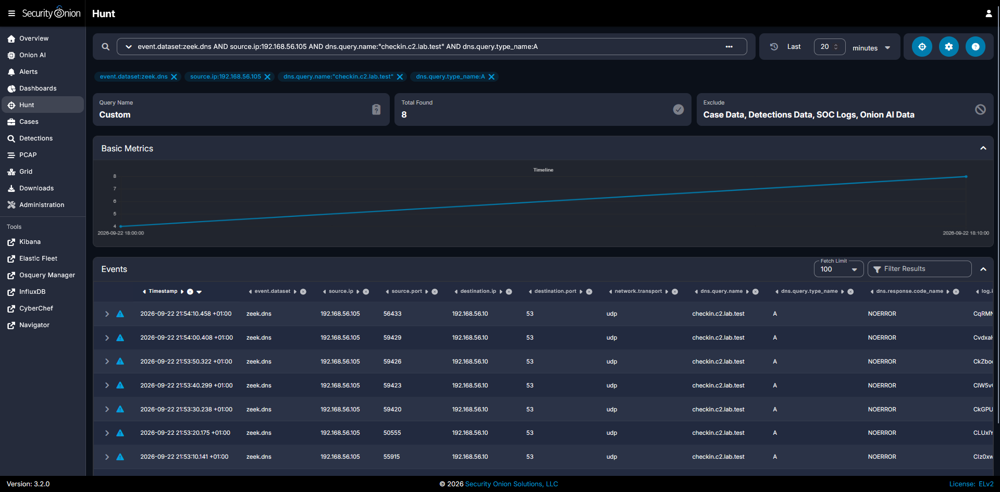

Small sub-second differences are expected from process startup, DNS handling, and telemetry ingestion. The important behavior was the repeated and highly regular interval.

Regular timing by itself does not prove command-and-control activity because legitimate applications can also poll services periodically. It becomes more meaningful when combined with endpoint process context and other DNS anomalies.

## Endpoint Process Correlation

The DNS activity was then correlated with endpoint process telemetry to identify what process generated the requests.

Query used:

```text
event.dataset:endpoint.events.process AND process.name:nslookup.exe AND process.command_line:*checkin.c2.lab.test*
```

Security Onion returned eight `nslookup.exe` process events.

The endpoint telemetry showed:

- host: `victim`
- user: `admin`
- process: `nslookup.exe`
- parent process: `powershell.exe`
- repeated executions matching the beaconing time window

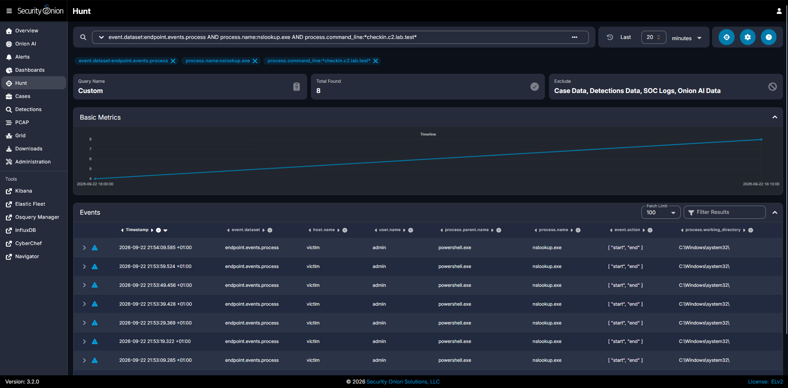

This established the endpoint-side process chain responsible for the network activity:

```text
powershell.exe
    └── nslookup.exe
            └── DNS query: checkin.c2.lab.test
```

## Cross-Source Timeline Correlation

A combined hunt was then used to place the endpoint process events and Zeek DNS events in the same result set.

Query used:

```text
(source.ip:192.168.56.105 AND dns.query.name:"checkin.c2.lab.test" AND event.dataset:zeek.dns AND dns.query.type_name:A)
OR
(event.dataset:endpoint.events.process AND process.name:nslookup.exe AND process.command_line:*checkin.c2.lab.test*)
```

The hunt returned `16` events:

- `8` endpoint `nslookup.exe` process events
- `8` Zeek DNS `A`-record events

The events appeared interleaved in time. Example pairs included:

| Endpoint Process Event | Zeek DNS Event |
|---|---|
| `21:53:39.428` | `21:53:40.299` |
| `21:53:49.456` | `21:53:50.322` |
| `21:53:59.524` | `21:54:00.408` |
| `21:54:09.585` | `21:54:10.458` |

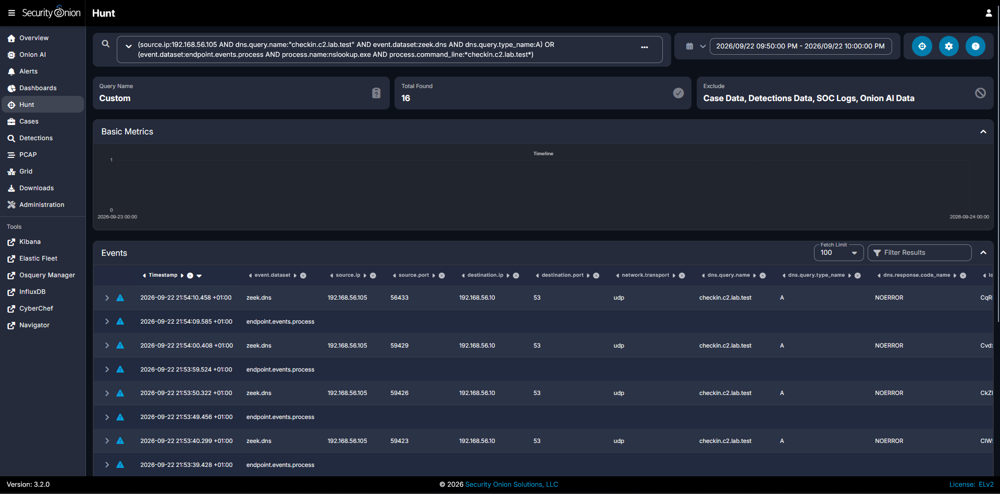

This was important because it showed that the network beaconing pattern and the endpoint process activity described the same sequence of events rather than two unrelated observations.

## Environment-Wide Scoping

After identifying the long DNS query behavior on the Windows endpoint, the monitored environment was searched for similar activity from other source hosts.

Query used:

```text
event.dataset:zeek.dns AND dns.query.length:[31 TO 255] AND NOT source.ip:192.168.56.105
| table soc_timestamp source.ip destination.ip destination.port dns.query.length dns.query.name dns.query.type_name
```

The search returned:

```text
Total Found: 0
```

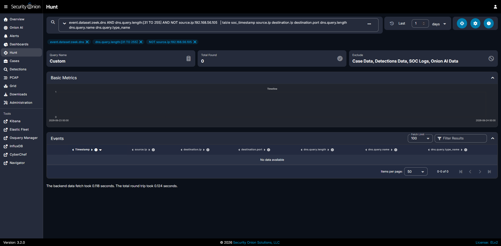

Within the monitored one-day investigation window, no other observed source host generated DNS queries matching the same long-query heuristic.

This does not prove that no other system could ever generate similar activity. It only shows that the pattern was not present from other monitored sources in the data and time window reviewed.

## Incident Timeline

All times below are shown using the Security Onion interface time zone (`+01:00`).

| Time | Event |
|---|---|
| `17:18–17:19` | Normal `lab.test` DNS requests were generated and reviewed to establish the baseline. |
| `18:09–18:10` | Controlled hex-encoded subdomain queries under `exfil.lab.test` were observed in Zeek DNS telemetry. |
| `18:10` | Long-query hunting identified DNS names with a length of `47`. |
| Analysis stage | The hexadecimal DNS label `534f432d4c41422d44454d4f2d303035` was decoded to `SOC-LAB-DEMO-005` with CyberChef. |
| `21:53:09–21:54:10` | PowerShell repeatedly launched `nslookup.exe`, producing eight `checkin.c2.lab.test` DNS `A` queries at approximately ten-second intervals. |
| `21:53–21:54` | Endpoint process telemetry and Zeek DNS telemetry were correlated into a combined 16-event timeline. |
| Scoping stage | A hunt excluding `192.168.56.105` found no other monitored source with DNS query lengths of `31` or greater during the reviewed one-day window. |

## Indicators and Observables

| Type | Value | Role |
|---|---|---|
| Endpoint | `Victim` | Windows endpoint where the controlled activity executed |
| Endpoint IP | `192.168.56.105` | Source of the investigated DNS traffic |
| DNS Server | `192.168.56.10` | Kali Linux host running the controlled `dnsmasq` service |
| Protocol | `DNS / UDP 53` | Network protocol used during the lab |
| Baseline Namespace | `lab.test` | Controlled domain used for normal DNS traffic |
| Encoded Namespace | `exfil.lab.test` | Namespace used for simulated exfiltration-like DNS queries |
| Beacon Domain | `checkin.c2.lab.test` | Domain used for periodic DNS check-ins |
| Suspicious Query Length | `47` | Length observed for the encoded `exfil.lab.test` queries |
| Encoded Marker | `534f432d4c41422d44454d4f2d303035` | Hexadecimal value embedded in a DNS label |
| Decoded Marker | `SOC-LAB-DEMO-005` | Harmless lab value recovered with CyberChef |
| Endpoint Process | `nslookup.exe` | Process that generated the beacon DNS requests |
| Parent Process | `powershell.exe` | Process repeatedly launching `nslookup.exe` |
| Beacon Count | `8` | Number of filtered Zeek DNS `A` events in the beacon simulation |
| Beacon Interval | approximately `10 seconds` | Regular cadence generated by the PowerShell loop |
| Combined Correlation Events | `16` | Eight endpoint process events plus eight Zeek DNS events |
| Scope Result | `0` other hosts | No matching long-query source observed after excluding `192.168.56.105` in the reviewed window |

## MITRE ATT&CK Mapping

### T1071.004 — Application Layer Protocol: DNS

The simulated periodic DNS check-ins map to **T1071.004 — Application Layer Protocol: DNS** under the **Command and Control** tactic.

Evidence supporting this mapping:

- the endpoint repeatedly communicated using DNS
- the same DNS name was queried at a regular interval
- the traffic blended into a protocol that is normally expected in most networks
- Zeek captured the periodic DNS behavior directly
- endpoint telemetry linked the requests to repeated `nslookup.exe` execution from PowerShell

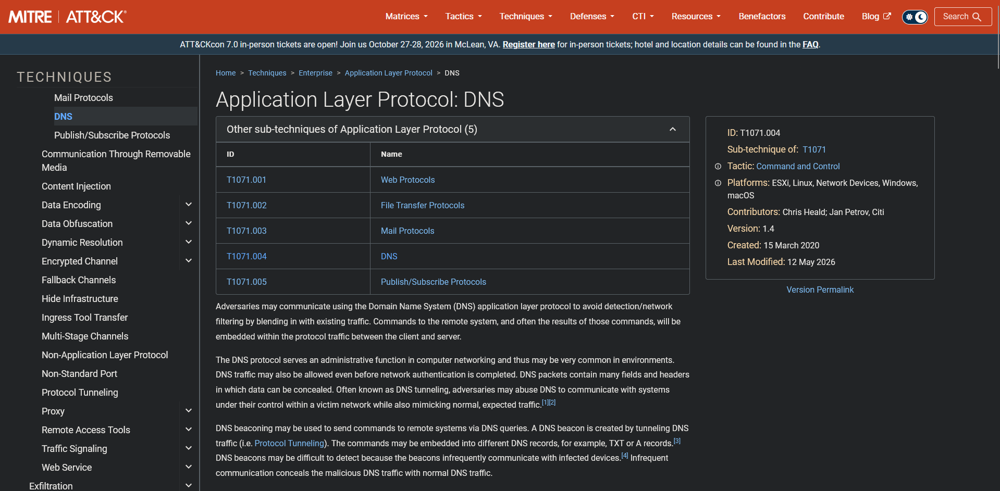

The lab reproduced the observable characteristics of DNS beaconing without using malware or real command-and-control infrastructure.

### T1048.003 — Exfiltration Over Alternative Protocol: Exfiltration Over Unencrypted Non-C2 Protocol

The controlled encoded-subdomain activity maps to the **mechanism described by T1048.003 — Exfiltration Over Unencrypted Non-C2 Protocol** under the **Exfiltration** tactic.

Evidence supporting this mapping:

- application data was represented inside the DNS query name
- the value was placed in a DNS subdomain label
- the data was encoded as hexadecimal rather than transmitted as directly readable text
- CyberChef recovered the original marker from the DNS label
- Zeek preserved the full DNS query name in network telemetry

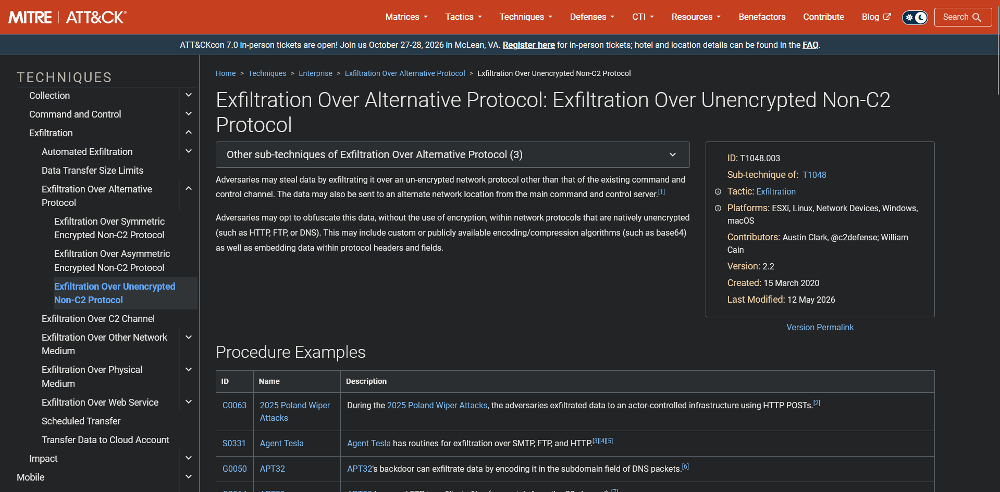

No sensitive information was stolen or transferred in this project. The activity intentionally simulated the telemetry pattern associated with DNS-based exfiltration using harmless lab markers.

## Findings and Analyst Verdict

The investigation confirmed that the controlled lab activity produced two distinct suspicious DNS patterns that could warrant investigation in a real SOC environment: encoded data embedded inside unusually long DNS queries and repeated DNS requests with a highly regular cadence.

Key findings:

- a normal DNS baseline was established before suspicious activity was generated
- normal lab DNS names were short and human-readable
- the encoded `exfil.lab.test` queries were substantially longer, with a query length of `47`
- the suspicious DNS labels contained recoverable hexadecimal data
- CyberChef decoded one observed value to `SOC-LAB-DEMO-005`
- detailed Zeek telemetry confirmed the encoded query originated from `192.168.56.105` and was sent to `192.168.56.10:53`
- eight `checkin.c2.lab.test` `A` queries occurred at approximately ten-second intervals
- endpoint telemetry showed eight matching `nslookup.exe` executions
- `powershell.exe` was the parent process of the repeated `nslookup.exe` activity
- a combined hunt correlated eight endpoint process events with eight Zeek DNS events
- environment-wide scoping found no other monitored source matching the long-query heuristic during the reviewed one-day window
- the beaconing behavior mapped to MITRE ATT&CK `T1071.004`
- the encoded DNS subdomain behavior mapped to the exfiltration mechanism described by `T1048.003`

Because the activity was intentionally generated inside an isolated lab, it was known to be benign. In a real environment, however, the combination of unusually long encoded DNS labels, recoverable data inside subdomains, regular beaconing intervals, and suspicious process context would justify deeper investigation.

None of these indicators should be treated as proof of compromise in isolation. Long DNS names can be produced by legitimate applications, regular polling can be normal software behavior, and command-line DNS tools have legitimate administrative uses. The strength of the investigation comes from correlating multiple signals rather than relying on a single heuristic.

## Recommendations and Remediation

In a real environment, the following actions would be appropriate:

- identify the affected endpoint, user, and business context associated with the DNS activity
- determine whether the queried domains are expected for the host and organization
- compare suspicious DNS names against a known-good baseline for the environment
- review DNS query length, character composition, subdomain depth, frequency, and repetition for additional anomalies
- decode suspicious subdomain content when it appears to contain Base64, hexadecimal, or another recognizable encoding
- correlate DNS telemetry with endpoint process telemetry to identify the process responsible for the requests
- inspect the full parent and child process chain around the DNS-generating process
- review command-line arguments, scripts, scheduled tasks, services, and persistence mechanisms associated with the initiating process
- search other endpoints for the same domain, subdomain pattern, query length, or beacon cadence
- review surrounding network activity for additional command-and-control or exfiltration indicators
- validate whether the destination DNS infrastructure is authorized and expected
- if the activity is unauthorized, isolate the affected endpoint as appropriate and preserve relevant evidence for deeper investigation
- block or sinkhole confirmed malicious domains or DNS infrastructure according to organizational procedures
- review the user's credentials and sessions if broader compromise is suspected
- tune detections using environmental baselines rather than treating every long DNS query or periodic request as malicious
- consider detection logic that combines multiple signals such as long or encoded labels, unusual domains, repeated cadence, endpoint process context, and host rarity

A DNS-only detection can produce false positives because many legitimate applications generate complex or periodic DNS traffic. Correlating Zeek network telemetry with endpoint execution data provides stronger context and makes analyst conclusions more defensible.

## What I Learned

-I learned how important baselining is before classifying activity as suspicious, having a baseline essentially is knowing what "normal" looks like, so when activity deviates from that baseline, an analyst can investigate and determine if any further steps need to be taken.

-I learned how DNS can carry data, not just resolve domain names, which can be abused as a channel for data exfiltration where unauthorized data can be subtly leaked through what looks like standard queries. Some clues include unusually long DNS queries, unusual query structure, encoded-looking data, and abnormal frequency. Legitimate activity can still have all these present so the traffic should be investigated closely before making a conclusion. 

-I learned how and why scoping suspicious behavior across the entire environment is essential to ensure no other compromised systems are missed. Identifying every affected system is essential for proper containment and remediation, because missing one compromised host can allow the threat to persist.

-I learned how endpoint telemetry can explain network telemetry. Zeek showed repeated DNS requests, while endpoint telemetry showed "powershell.exe → nslookup.exe". Network telemetry captures what communication occurred, while endpoint telemetry reveals specifically which process initiated it.

-I learned how to distinguish DNS beaconing and DNS exfiltration by looking at the behavior of the queries, not just the fact DNS was being used. Traffic volume and timing patterns matter. In the project, beaconing appeared as small repeated requests for the same domain at a regular interval, while the exfiltration-style activity used changing encoded data inside subdomains. In short, beaconing usually involves periodic check-ins or command-and-control communication, while DNS exfiltration uses DNS queries to transfer data out of a system.
